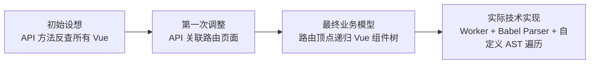
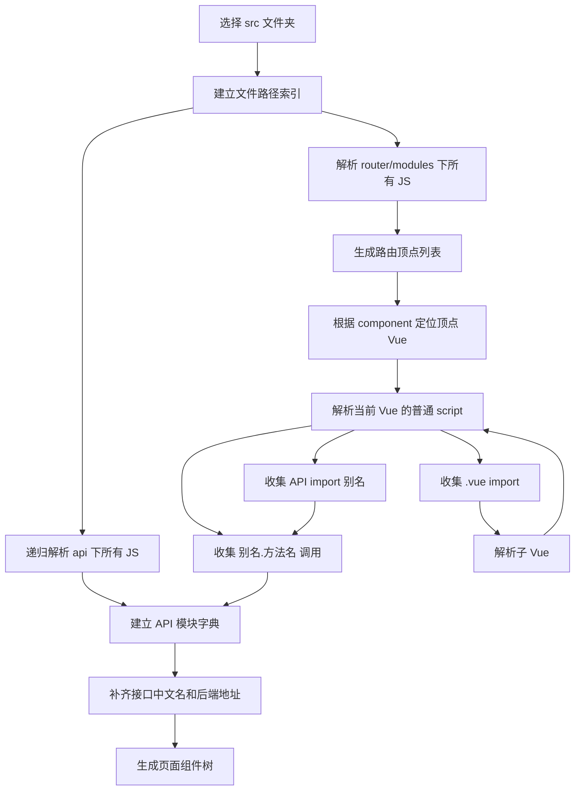
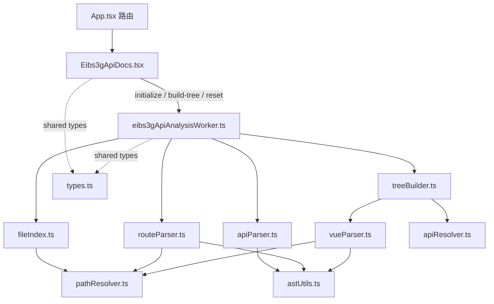

# EIBS3G 网银接口文档功能设计

> 文档状态：第一版已实现并完成前端构建、JAR 打包与本地页面验证，当前尚未提交  
> 功能位置：研发工具 → 接口管理 → 网银接口文档  
> 数据来源：用户在页面中选择网银前端项目的 `src` 文件夹  
> 运行环境：内网离线运行，分析过程默认只在浏览器本地完成

## 0. 已确认结论速览

| 项目 | 已确认方案 |
|---|---|
| 分析入口 | `router/modules/**/*.js` 中的路由 `component` |
| 顶点 | 路由对应的 Vue 页面 |
| 树边 | Vue 普通 `<script>` 中导入的 `.vue` 文件 |
| 节点接口 | 当前 Vue 通过已导入 API 模块直接调用的接口 |
| API 范围 | 递归扫描 `src/api/**/*.js` |
| 省略 API 后缀 | `@/api/wealthManage` 直接解析为 `src/api/wealthManage.js` |
| API 中文名 | API 方法上方紧邻的注释；缺失时留空 |
| 顶点中文名 | 路由 `meta.title` |
| 子组件中文名 | 不展示 |
| Vue 语法 | 只处理普通 `<script>` |
| 路由与 Vue | 当前按一一对应处理 |
| 缺失文件 | 放弃对应顶点、组件分支或接口关系，整体继续 |
| 运行方式 | 浏览器本地离线分析，不上传源码到后端 |
| 实际页面路由 | `/interface/bank-api-docs` |
| 实际菜单权限 | `interface:bank-api-docs` |
| 解析线程 | Vite module Web Worker |
| AST 实现 | `@babel/parser` + 项目内自定义 `walkAst`，不使用 `@babel/traverse` |
| 当前交付状态 | 功能代码已完成，等待提交与真实网银源码验证 |

## 1. 功能目标

从网银前端路由配置出发，为每一个路由页面构建完整的 Vue 组件依赖树，并在每个页面/组件节点中展示该文件直接调用的后端接口。

最终关系为：

```text
路由配置
└─ 顶点 Vue 页面（文件名 + meta.title）
   ├─ 本页面直接调用的 API
   ├─ 子 Vue 组件（仅显示文件名）
   │  ├─ 该组件直接调用的 API
   │  └─ 更深层子 Vue 组件
   └─ 其他子 Vue 组件
```

核心定义：

```text
路由对象是顶点
.vue import 是树边
Vue 文件是树节点
当前 Vue 文件直接调用的 API 是节点内容
```

## 2. 与最初方案的区别

最初方案以 API 为起点：

```text
API 方法 → 搜索调用它的 Vue → 匹配路由 → 得到页面
```

当前确认方案以路由为起点：

```text
路由 component → 顶点 Vue → 子 Vue 递归 → 各节点直接调用的 API
```

`src/api` 不再是遍历入口，只负责提供接口字典：

```text
API 模块路径 + 前端方法名
→ 接口中文注释
→ HTTP 方法
→ 后端接口地址
```

### 2.1 方案演进记录

本功能在需求确认和实现过程中经历了以下变化：



| 阶段 | 核心思路 | 调整原因 |
|---|---|---|
| 初始设想 | 从 `src/api` 方法名出发，全局搜索调用它的 `.vue` 文件，再去路由中匹配页面 | 只能得到“接口在哪些页面出现”，无法准确表达子组件是如何被顶点页面组合进来的 |
| 中间方案 | 统计后端地址到多个路由页面的连线关系 | 多个组件会间接承载接口，平铺连线不利于理解真实组件层级 |
| 最终方案 | 从路由 `component` 得到顶点 Vue，沿 `.vue` import 递归，在每个节点展示其直接调用的 API | 与网银前端真实装配关系一致，能够区分页面直接调用和子组件调用 |
| 技术落地调整 | 不使用 `@babel/traverse`，改用浏览器安全的自定义 AST 遍历 | `@babel/traverse` 的依赖链在当前浏览器 Worker 构建中引用了 Node 全局变量，曾触发 `Uncaught ReferenceError: process is not defined` |

因此，当前页面的主视图不是“接口到页面”的扁平统计图，而是：

```text
路由页面（顶点）
├─ 顶点页面直接调用的接口
├─ 子组件 A
│  ├─ 子组件 A 直接调用的接口
│  └─ 更深层子组件
└─ 子组件 B
   └─ 子组件 B 直接调用的接口
```

## 3. 已确认的网银代码格式

### 3.1 API 文件

API 文件位于：

```text
src/api
```

`api` 下既有直接的 `.js` 文件，也可能存在子文件夹，因此必须递归读取：

```text
src/api/**/*.js
```

典型格式：

```js
import remote from '@/services/remote';

export default {
  // 资产池签约信息查询
  entAPSignInfoQry(payload) {
    return remote.post('product/entAPSignInfoQry.do', {
      payload,
    });
  },
};
```

需要提取：

| 字段 | 示例 |
|---|---|
| API 模块 | `api/assetPool.js` |
| 前端 API 方法名 | `entAPSignInfoQry` |
| API 中文名 | `资产池签约信息查询` |
| HTTP 方法 | `POST` |
| 后端地址 | `product/entAPSignInfoQry.do` |

API 中文名只取 API 方法上方紧邻的注释。缺少注释时中文名留空，不自动推断。

### 3.2 路由文件

路由文件位于：

```text
src/router/modules/**/*.js
```

典型格式：

```js
export default {
  children: ((pre) => [
    {
      path: 'accessPoolManage/counterBondQry',
      name: `${pre}-accessPoolManage-counterBondQry`,
      component: () => import(
        /* webpackChunkName: "assetPool" */
        '@/views/asset-pool/access-pool-manage/counter-bond/counter-bond-qry.vue'
      ),
      meta: {
        ...meta,
        title: '结构性存款入池',
        highlightTo: 'deposit',
      },
    },
  ]),
};
```

需要提取：

| 字段 | 用途 |
|---|---|
| `path` | 路由地址 |
| `name` | 路由名称 |
| `component` | 定位顶点 Vue 文件 |
| `meta.title` | 顶点页面中文名 |
| 路由文件路径 | 定位来源和错误诊断 |

`webpackChunkName` 和 `highlightTo` 不参与组件文件匹配。

当前已确认不会出现两个路由对象指向同一个 Vue 文件，因此不设计重复顶点的业务展示。

### 3.3 顶点 Vue 文件

网银项目使用普通 `<script>`，当前不考虑 `<script setup>`。

已确认的 API 导入格式：

```js
import wealthManageApi from '@/api/wealthManage';
import assetPoolApi from '@/api/assetPool.js';
```

省略 `.js` 后缀只表示漏写后缀，直接补 `.js`：

```text
@/api/wealthManage
→ src/api/wealthManage.js
```

不再尝试以下冗余候选：

```text
src/api/wealthManage
src/api/wealthManage/index.js
```

子组件导入格式：

```js
import counterBondDetail from './counter-bond-detail.vue';
```

组件注册格式：

```js
export default {
  name: 'assetPool-accessPoolManage-counterBondQry',
  components: {
    counterBondDetail,
  },
};
```

接口调用格式：

```js
let res = await wealthManageApi.entInvCounterDebtSignInfoQry(params);
```

这里的关系为：

```text
wealthManageApi
→ import '@/api/wealthManage'
→ src/api/wealthManage.js

entInvCounterDebtSignInfoQry
→ 在 wealthManage.js 的默认导出对象中查找同名方法
→ 获取 API 中文注释、HTTP 方法和后端地址
```

Vue 文件自己的业务方法注释不作为 API 中文名。例如：

```js
// 资金账户（签约账号）列表查询
async getCounterDebtSignInfoQry() {
  return wealthManageApi.entInvCounterDebtSignInfoQry(params);
}
```

API 中文名必须取 `src/api/wealthManage.js` 中 `entInvCounterDebtSignInfoQry` 方法上方的注释。

## 4. 已确认的设计约束

1. 用户只选择网银项目的 `src` 文件夹。
2. 系统离线运行，不依赖 GitHub、Gitee 或其他网络服务。
3. `src/api` 下的所有子目录都要递归检查并读取其中的 `.js` 文件。
4. API 模块导入省略扩展名时，直接补 `.js`，不尝试目录和 `index.js`。
5. 从 `router/modules` 的路由 `component` 开始定位顶点 Vue。
6. 只解析普通 `<script>`，不处理 `<script setup>`。
7. 只沿 `.vue` import 继续递归，不递归普通 `.js`、Mixin、Vuex 或第三方包。
8. 顶点页面中文名取路由 `meta.title`。
9. 子组件默认不展示中文名称。
10. 每个 Vue 节点只展示该文件直接调用的 API，不把子组件 API 冒充成父页面直接调用。
11. API 必须通过已导入的 `@/api/...` 模块别名定位。
12. 当前不处理两个路由对象指向同一个 Vue 文件的场景。
13. 缺少中文注释时留空。
14. 文件不存在或无法解析时，只放弃对应顶点、组件分支或接口关系，不中断整体分析。

### 暂不纳入第一版

- `<script setup>`。
- 全局注册但没有 `.vue` import 的组件。
- 动态拼接组件路径。
- `require.context`。
- 通过普通 JS、Mixin、Store、Composable 间接调用的 API。
- 计算属性形式的 API 调用，例如 `apiObject[methodName]()`。
- 将 `getToken('product/xxx.do')` 之类的后端地址字符串当作标准 API 调用。
- API 结果持久化和多人共享。
- 在线 Git 仓库读取。

## 5. 总体逻辑架构



### 5.1 第一阶段：文件索引

目录选择完成后，浏览器会先枚举所选目录中的文件，并把 `File[]` 发送给 Worker。Worker 只为以下目标文件建立路径索引，不读取其他文件内容：

```ts
Map<string, File>
```

索引只保留：

```text
api/**/*.js
router/modules/**/*.js
views/**/*.vue
```

其他文件不读取。

需要注意：浏览器的文件夹选择控件仍需先枚举整个 `src` 目录，这是浏览器 API 本身的行为；进入 Worker 后，非目标文件会立即被排除。实际进度会分别显示索引、API、路由和组件树阶段，不再长期停留在无法解释的 `1%`。

### 5.2 第二阶段：API 字典

API 文件全部只解析一次，按模块路径建立索引：

```ts
Map<string, ApiModuleDefinition>
```

示例：

```text
api/wealthManage.js
├─ entInvCounterDebtSignInfoQry
├─ methodB
└─ methodC

api/assetPool.js
├─ entAPSignInfoQry
└─ entAPAssetListQry
```

必须按“API 模块路径 + 方法名”定位，不能只按方法名全局匹配。

### 5.3 第三阶段：路由顶点

对每条存在静态 `component` 路径的路由生成一个顶点：

```ts
{
  routePath,
  routeName,
  title,
  componentPath,
  routerFile
}
```

路径转换示例：

```text
@/views/asset-pool/access-pool-manage/counter-bond/counter-bond-qry.vue
→ views/asset-pool/access-pool-manage/counter-bond/counter-bond-qry.vue
```

### 5.4 第四阶段：解析单个 Vue

对普通 `<script>` 建立两个 import 映射：

```ts
apiImports: Map<LocalAlias, ApiModulePath>
vueImports: Map<LocalComponentName, VueFilePath>
```

根据图3：

```text
API：
wealthManageApi → api/wealthManage.js
assetPoolApi    → api/assetPool.js

组件：
counterBondDetail
→ views/asset-pool/access-pool-manage/counter-bond/counter-bond-detail.vue
```

识别 API 调用时只处理：

```js
apiImportAlias.apiMethod(...)
```

例如：

```js
wealthManageApi.entInvCounterDebtSignInfoQry(params)
```

实际实现会扫描普通 `<script>` AST 中所有直接的成员调用，但只有调用对象是已识别 API 默认导入别名时才建立关系。多个位置重复调用同一个“模块路径 + 方法名”时，当前节点只展示一条接口记录，并保留第一次识别到的调用行号。

`.vue` 依赖目前按“存在默认导入且 import 路径以 `.vue` 结尾”识别。第一版沿所有满足条件的 `.vue` import 递归，不再额外要求它必须出现在 `components` 注册对象中。

### 5.5 第五阶段：递归构建组件树

伪代码：

```ts
async function buildVueNode(componentPath, ancestors) {
  if (ancestors.has(componentPath)) {
    return createCycleMarker(componentPath);
  }

  const parsedVue = await parseVueOnce(componentPath);
  if (!parsedVue) {
    return null;
  }

  const directApis = resolveDirectApis(parsedVue);
  const children = [];

  for (const childPath of parsedVue.vueImports) {
    const child = await buildVueNode(
      childPath,
      new Set([...ancestors, componentPath])
    );

    if (child) {
      children.push(child);
    }
  }

  return {
    componentPath,
    fileName: getFileName(componentPath),
    directApis,
    children,
  };
}
```

循环检测是防止异常 import 导致无限递归的技术保护，不代表当前项目已确认存在循环引用。

实际实现还包含以下保护：

- 同一父节点重复导入同一个组件路径时先去重。
- 同级子组件使用 `Promise.all` 并行构建。
- Vue 文件解析结果按完整组件路径缓存，同一文件在本次上传会话中只读取和解析一次。
- 每次重新选择目录或点击“重新分析”会重置 Worker 会话，并通过 generation 和 requestId 忽略旧任务的迟到结果。
- 页面卸载时终止 Worker，避免后台线程残留。

## 6. 路径解析规则

统一路径格式：

```text
\ → /
```

上传的 `src` 目录前缀从比较键中移除：

```text
src/views/a/b/page.vue
→ views/a/b/page.vue
```

### 6.1 路由组件

```text
@/views/a/b/page.vue
→ views/a/b/page.vue
```

要求完整路径精确匹配。找不到时不使用“文件名 + 上两级目录”模糊匹配，直接跳过该顶点并记录诊断。

### 6.2 子 Vue 组件

当前文件：

```text
views/asset-pool/access-pool-manage/counter-bond/counter-bond-qry.vue
```

导入：

```js
import counterBondDetail from './counter-bond-detail.vue';
```

解析结果：

```text
views/asset-pool/access-pool-manage/counter-bond/counter-bond-detail.vue
```

### 6.3 API 模块

```text
@/api/wealthManage
→ api/wealthManage.js

@/api/assetPool.js
→ api/assetPool.js

@/api/folder/module
→ api/folder/module.js
```

不尝试 `/index.js`。

## 7. 核心数据结构

```ts
interface ApiDefinition {
  modulePath: string;
  methodName: string;
  chineseName: string;
  httpMethod: string;
  endpoint: string;
  sourceLine: number;
}

interface RouteRoot {
  routePath: string;
  routeName: string;
  title: string;
  componentPath: string;
  routerFile: string;
}

interface ParsedVue {
  componentPath: string;
  fileName: string;
  componentName: string;
  apiImports: Record<string, string>;
  vueImports: string[];
  apiCalls: Array<{
    alias: string;
    methodName: string;
    sourceLine: number;
  }>;
}

interface VueTreeNode {
  componentPath: string;
  fileName: string;
  componentName: string;
  isRouteRoot: boolean;
  routeTitle?: string;
  directApis: ApiReference[];
  children: VueTreeNode[];
  diagnostics: AnalysisDiagnostic[];
}
```

## 8. 页面设计

### 8.1 页面位置

```text
研发工具
└─ 接口管理
   └─ 网银接口文档
```

建议路由：

```text
/interface/bank-api-docs
```

建议权限：

```text
interface:bank-api-docs
```

### 8.2 页面结构

```text
┌──────────────────────────────────────────────────────────────┐
│ 网银接口文档                           [选择 src] [重新分析] │
│ 当前目录：FIBS3G_WEB_TRANS/src                              │
│ 路由文件 31    顶点页面 186    已解析 Vue 128    API 320    │
├───────────────────┬──────────────────────────────────────────┤
│ 搜索顶点页面      │ 结构性存款入池                           │
│                   │ counter-bond-qry.vue                     │
│ ● 结构性存款入池  │ accessPoolManage/counterBondQry          │
│   counter-bond... │                                          │
│                   │          ┌──────────────────────┐        │
│ ○ 入池结果        │          │ counter-bond-qry.vue │        │
│   structured...   │          │ 结构性存款入池        │        │
│                   │          │                      │        │
│ ○ 资产池详情      │          │ entInv...Qry         │        │
│   index.vue       │          │ 资金账户列表查询      │        │
│                   │          │ POST product/...do   │        │
│                   │          └──────────┬───────────┘        │
│                   │                     ▼                    │
│                   │          ┌────────────────────────┐      │
│                   │          │ counter-bond-detail.vue│      │
│                   │          │                        │      │
│                   │          │ 该组件直接调用的接口    │      │
│                   │          └────────────────────────┘      │
└───────────────────┴──────────────────────────────────────────┘
```

### 8.3 节点展示规则

顶点节点：

```text
counter-bond-qry.vue
结构性存款入池

entInvCounterDebtSignInfoQry
接口中文注释
POST product/xxx.do
```

子组件节点：

```text
counter-bond-detail.vue

接口方法名
接口中文注释
POST product/xxx.do
```

子组件不显示中文名称行。

没有直接调用接口的组件仍需显示，因为它可能包含更深层子组件：

```text
counter-bond-detail.vue
本组件未直接调用接口
```

### 8.4 页面交互

- 选择 `src` 后先校验目录并显示文件统计。
- 左侧显示所有有效路由顶点，支持按 `meta.title`、Vue 文件名和路由路径搜索。
- 点击顶点后按需构建并显示当前组件树。
- 默认展开两级，可展开全部或逐节点展开。
- 点击节点查看完整路径、API 模块、调用行号和子组件 import。
- 支持隐藏“无直接接口”的叶子节点，但不能隐藏承载下级组件的中间节点。
- 错误和跳过记录进入独立诊断抽屉，不污染主树。

### 8.5 第一版实际页面效果

第一版已经实现为“左侧路由顶点列表 +右侧组件树”的页面：

```text
┌──────────────────────────────────────────────────────────────┐
│ 网银接口文档                    [重新分析] [选择 src 文件夹] │
│ [分析阶段、文件进度和百分比]                                │
├──────────────────────────────────────────────────────────────┤
│ 已选文件 │ 路由文件 │ 路由顶点 │ Vue 文件 │ API 定义       │
├──────────────────┬───────────────────────────────────────────┤
│ 路由顶点与搜索框  │ 当前路由页面和组件依赖树                 │
│                  │ counter-bond-qry.vue（结构性存款入池）    │
│ 结构性存款入池    │ ├─ 当前页面直接调用的 API                │
│ 其他路由页面      │ └─ counter-bond-detail.vue               │
│                  │    └─ 子组件直接调用的 API                │
└──────────────────┴───────────────────────────────────────────┘
```

页面支持路由中文名、文件名和路由路径搜索，默认展开两级，并提供隐藏空叶子、全部展开、全部收起和重新分析。节点卡片直接展示接口方法名、中文注释、HTTP 方法和后端地址。

点击节点会打开详情抽屉，展示 Vue 完整路径、组件 `name`、路由来源、API 定义文件及行号、Vue 调用行号、导入别名、API 模块导入和 Vue 子组件导入。诊断抽屉集中展示文件缺失、语法解析失败、API 模块或方法不存在和循环引用等信息。

源码内容不会发送到后端；分析完成后只通过既有审计接口记录路由顶点数量和 API 定义数量等统计摘要。

## 9. 性能设计

新方案不会扫描全部 `views/**/*.vue` 后再为每个路由重复查找。

### 9.1 只解析可达 Vue

```text
路由顶点
→ 顶点 Vue
→ 顶点 import 的 Vue
→ 子组件 import 的 Vue
```

未被任何路由组件树引用的 Vue 文件不会读取内容。

### 9.2 全局解析缓存

```ts
Map<string, Promise<ParsedVue>>
```

同一个组件无论被多少个父组件引用，都只读取和解析一次。

### 9.3 Web Worker

文件索引、AST 解析和树构建放到 Web Worker 中，主线程只负责上传、进度和展示。

Worker 分阶段报告：

```text
1. 建立文件索引
2. 解析 API 字典
3. 解析路由顶点
4. 构建当前组件树
5. 完成接口关联
```

实际 Worker 消息分为：

```text
initialize  → progress / ready / error
build-tree  → progress / tree / error
reset       → 清空会话并使旧异步结果失效
```

初始化阶段的进度区间为：文件索引约 `2%～15%`、API 解析约 `15%～50%`、路由解析约 `50%～95%`，基础分析完成为 `100%`。API 和路由每处理首个文件、每 10 个文件及最后一个文件时上报进度，避免过于频繁地刷新主线程。

### 9.4 懒构建

进入结果页时先得到全部有效路由顶点，然后自动构建排序后的第一棵树；用户选择其他顶点时再构建对应组件树。

当前缓存粒度是 `ParsedVue`，不是完整 `VueTreeNode`：重复选择一个顶点时会重新组装树，但已经解析过的 Vue 文件不会重新读取和重新做 AST 解析。如真实项目仍有明显等待，再考虑增加路由树结果缓存。

### 9.5 浏览器兼容性调整

最初计划使用 `@babel/parser` 和 `@babel/traverse`。实际运行时曾出现：

```text
Uncaught ReferenceError: process is not defined
```

根因是浏览器 Worker 加载的依赖链包含面向 Node.js 的运行时代码。最终处理方式是：

- 保留 `@babel/parser` 负责 JavaScript AST 解析。
- `@babel/types` 仅作为 TypeScript 类型依赖。
- 新增 `services/eibs3gApiAnalyzer/astUtils.ts`，以纯浏览器代码递归遍历 AST。
- 不引入 `@babel/traverse`，也不通过伪造 `window.process` 或 `process` 全局变量规避问题。

这项调整保证分析器在 Vite module Worker 和最终 JAR 内置静态资源中均可运行。

## 10. 失败处理

| 情况 | 处理方式 |
|---|---|
| `api` 目录不存在 | 阻止分析并提示目录错误 |
| `router/modules` 不存在 | 阻止分析并提示目录错误 |
| `views` 不存在 | 阻止分析并提示目录错误 |
| 单个 API 文件读取失败 | 跳过该文件，继续解析其他 API |
| API 中文注释缺失 | 中文名留空，接口继续展示 |
| 路由 `meta.title` 缺失 | 顶点中文名留空 |
| 路由 component 文件不存在 | 放弃该顶点 |
| 子 Vue 文件不存在 | 放弃该组件分支，保留父节点和其他分支 |
| Vue 中没有 `<script>` | 保留节点，接口和子组件均为空 |
| Vue script 语法解析失败 | 放弃当前节点的接口和后代分析，记录诊断 |
| API import 对应文件不存在 | 放弃该 API 模块产生的接口关系 |
| API 方法在对应模块中不存在 | 放弃该接口关系 |
| API 调用不存在中文注释 | 中文名留空 |
| 检测到循环 import | 停止该分支，记录循环路径 |
| Worker 本身加载或运行失败 | 页面显示实际浏览器错误，并明确提示该分析不经过后端、后端控制台不会有分析日志 |
| Worker 返回无法结构化克隆的数据 | 页面提示刷新并重新选择 `src` 文件夹 |

任何单文件失败都不能终止整个项目分析。

## 11. 第一版实际代码改动

### 11.1 新增文件

```text
pages/interface/Eibs3gApiDocs.tsx
workers/eibs3gApiAnalysisWorker.ts

services/eibs3gApiAnalyzer/
├─ types.ts
├─ astUtils.ts
├─ fileIndex.ts
├─ pathResolver.ts
├─ apiParser.ts
├─ routeParser.ts
├─ vueParser.ts
├─ apiResolver.ts
└─ treeBuilder.ts
```

职责：

| 文件 | 职责 |
|---|---|
| `Eibs3gApiDocs.tsx` | 上传、顶点列表、树展示、节点详情、诊断信息 |
| `eibs3gApiAnalysisWorker.ts` | 后台解析、缓存、进度和错误隔离 |
| `astUtils.ts` | 提供浏览器安全的 AST 类型判断与深度遍历，替代 `@babel/traverse` |
| `fileIndex.ts` | 建立上传文件路径索引 |
| `pathResolver.ts` | 处理 `@/`、相对路径、斜杠和 `.js` 补全 |
| `apiParser.ts` | 解析 API 方法、注释、HTTP 方法和后端地址 |
| `routeParser.ts` | 解析路由对象和顶点组件 |
| `vueParser.ts` | 解析普通 `<script>` 的 import 和 API 调用 |
| `apiResolver.ts` | 通过 API alias、模块路径和方法名关联接口 |
| `treeBuilder.ts` | 递归构建组件树、缓存和循环保护 |
| `types.ts` | 当前功能内部类型定义 |

### 11.2 修改现有文件

| 文件 | 修改内容 |
|---|---|
| `App.tsx` | 导入页面并注册 `/interface/bank-api-docs` |
| `backend/src/main/java/com/toolmanager/config/SecurityDataInitializer.java` | 在接口管理下新增“网银接口文档”菜单和权限 |
| `services/auditButton.ts` | 增加新页面审计名称映射 |
| `package.json` | 增加 `@babel/parser` 运行依赖和 `@babel/types` 类型依赖 |
| `package-lock.json` | 锁定新增解析依赖的实际版本 |

当前约束下不需要新增业务 Controller、Service、数据库表或远程仓库接口。

### 11.3 菜单、路由和审计的实际配置

```text
前端路由：/interface/bank-api-docs
菜单名称：网银接口文档
菜单层级：研发工具 → 接口管理 → 网银接口文档
菜单图标标识：network
菜单排序：接口管理下第 4 项
权限标识：interface:bank-api-docs
审计页面名称：网银接口文档
```

`SecurityDataInitializer.java` 同时补充了当前权限菜单模型 `sys_menu` 和兼容菜单模型 `menu_items`，避免两套初始化数据出现差异。

### 11.4 与功能一起出现、但不属于核心实现的文件

当前工作区的 `config/whiteList.txt` 还包含一次本地部署调试所需的 IP 增补。它与网银源码分析逻辑无关，提交时应单独确认该 IP 是否属于目标环境，避免把个人或临时地址误合入功能提交。

测试样例位于仓库外：

```text
C:/ownProject/fullSkyStars2026/testSamples/
└─ src/
   ├─ api/
   ├─ router/modules/
   ├─ services/
   └─ views/
```

该目录用于覆盖嵌套 API 目录、路由顶点、组件递归、缺失注释和循环依赖等场景，但它不在 `tool-manager` Git 仓库内，不会随当前分支提交。若团队需要长期复用，应另行决定是否把它纳入仓库。

### 11.5 实际代码调用关系



页面只负责目录选择、Worker 通信和结果展示；文件读取、AST 解析、缓存、组件递归和接口关联都在 Worker 内完成。该边界是“浏览器分析时界面仍可操作”和“源码不进入后端”的关键。

## 12. 第一版实际解析技术

当前只解析普通 JavaScript 和 Vue 普通 `<script>`，实际使用：

```text
@babel/parser
@babel/types（仅 TypeScript 类型）
services/eibs3gApiAnalyzer/astUtils.ts（浏览器安全的 AST 遍历）
```

不需要为了当前需求引入 Vue 3 的 `<script setup>` 解析支持。

AST 主要识别：

- `ImportDeclaration`
- `ExportDefaultDeclaration`
- `ObjectMethod`
- `CallExpression`
- `MemberExpression`
- 路由对象中的静态字符串和模板字符串

API 解析支持直接 `export default {}`，也支持先把对象赋给变量后再默认导出。HTTP 方法和后端地址只接受能够静态确定的值；带表达式的动态 URL 不作为标准 API 定义。

## 13. 实施进度与后续计划

### 阶段一：页面和入口（已完成）

1. 新增“网银接口文档”页面骨架。
2. 注册前端路由。
3. 增加菜单、权限和审计映射。
4. 复用现有文件夹选择方式，实现 `src` 上传。

### 阶段二：文件与 API 索引（已完成）

1. 建立上传文件索引。
2. 校验 `api`、`views`、`router/modules`。
3. 递归解析 `api/**/*.js`。
4. 建立模块路径级 API 字典。

### 阶段三：路由和 Vue 解析（已完成）

1. 解析路由顶点。
2. 使用 component 完整路径定位顶点 Vue。
3. 解析普通 `<script>` 中的 API import。
4. 解析 `.vue` import。
5. 识别 `apiAlias.method()` 调用。

### 阶段四：递归树和缓存（已完成）

1. 实现 Vue 解析缓存。
2. 实现组件递归。
3. 实现循环保护。
4. 实现单分支失败隔离。
5. 将 API 结果挂到真实调用节点。

### 阶段五：结果页面（已完成）

1. 顶点页面搜索和选择。
2. 树节点展示。
3. 展开、收起和隐藏空叶子。
4. 节点详情。
5. 分析进度和诊断抽屉。

### 阶段六：测试与验证

至少覆盖：

- API 根目录 `.js`。
- API 多级子目录 `.js`。
- API import 带 `.js`。
- API import 不带 `.js`，直接补 `.js`。
- 顶点 Vue 调用 API。
- 子组件调用 API。
- 多层子组件递归。
- 中间组件没有接口但包含子组件。
- API 中文注释缺失。
- 路由标题缺失。
- 子组件文件缺失。
- API 文件或方法缺失。
- 循环 import 防护。
- 大量路由和共享组件下的缓存有效性。

当前已经：

- 在仓库外建立 `C:/ownProject/fullSkyStars2026/testSamples/src` 测试数据。
- 完成前端 `npm run build`。
- 使用 JDK 11 完成 Spring Boot 可执行 JAR 打包。
- 确认构建产物中包含前端入口和 `eibs3gApiAnalysisWorker`。
- 完成页面基本运行验证，并修复 Worker 的 `process is not defined` 问题。

正式合并前仍应执行：

```bash
npm run build
```

并在内网目标浏览器中使用一份真实网银 `src` 目录进行手工验证。当前测试样例能够验证结构和容错逻辑，但不能替代真实项目在文件数量、历史语法和复杂依赖方面的验证。

## 14. 第一版明确不处理的直接地址引用

图4中存在：

```js
this.getToken(
  this.accessType === 'out'
    ? 'product/entOutPoolApply.do'
    : 'product/entInPoolApply.do'
);
```

第一版不把这里的 URL 当作标准 API 调用，因为它没有通过导入的 API 模块方法调用。若后续需要展示此类地址，应新增“直接地址引用”节点，并与能够追溯到 API 文件、方法名和中文注释的标准 API 调用分开展示。
